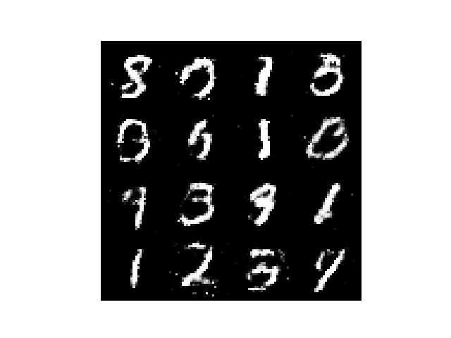
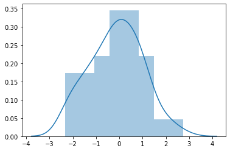
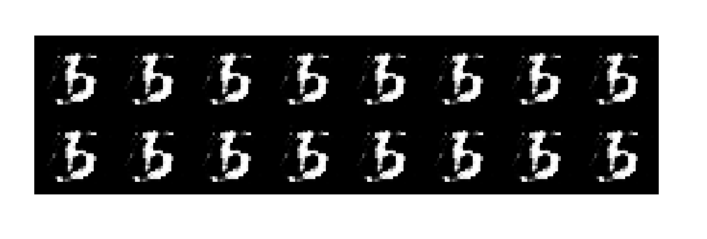
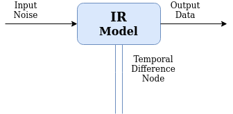

# Temporal Difference Learner for MNIST

A Generative Adversarial Model has been developed here for MNIST dataset. 

Input dimensions are:

- `batch_size x 100`

MNIST data generated by [Generator.py](./network/GeneratorNet.py)

# Input Noise

An input noise of:

Generated:

# Domain Modeller

The Temporal Difference Node is a Custom Layer that intercepts all successful inputs to the MNIST IR Model which then generates the digits with the right accuracy. The Custom Layer is built with Machine Learning. 

By having a Temporal Difference node, simulations on output data can be produced for the datasets. Simulating the output domain can lead to unseen data, which improves the visibility of the model for generating graphics.

## Memory analysis on the model

[ INFO ] GFLOPs: 0.048
[ INFO ] GIOPs: 0.000
[ INFO ] MParams: 1.489
[ INFO ] Sparsity: 0.000
[ INFO ] Minimum memory consumption: 0.033
[ INFO ] Maximum memory consumption: 0.125
[ INFO ] Network status information file name: [model/model_report.csv](./model/model_report.csv)
